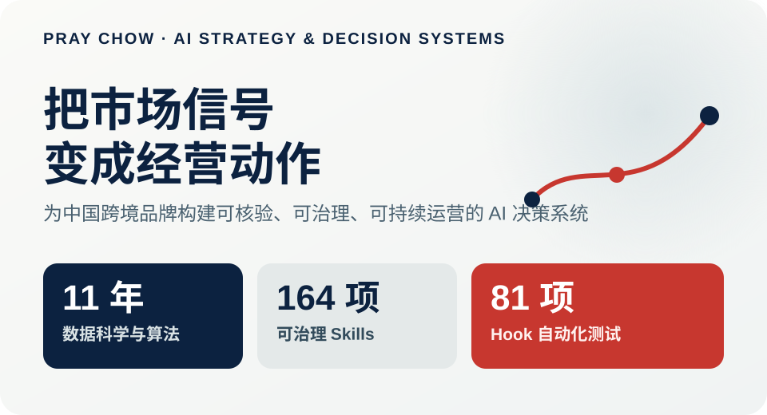
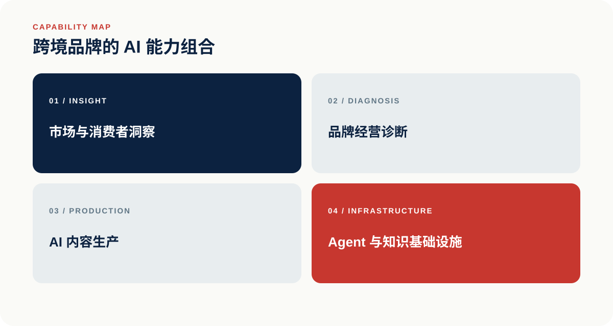
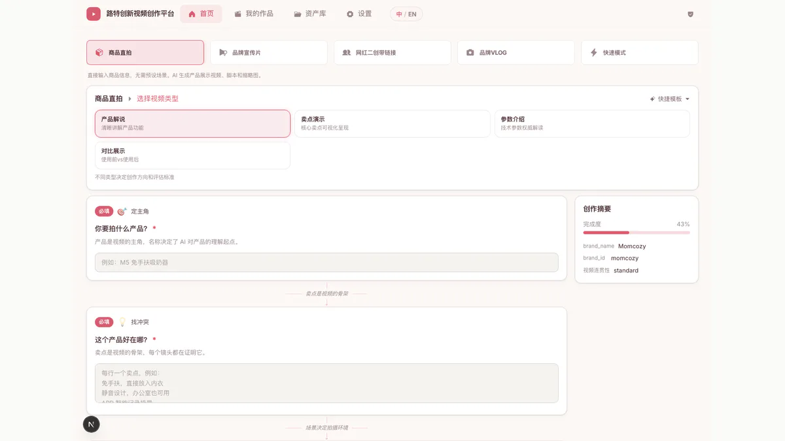
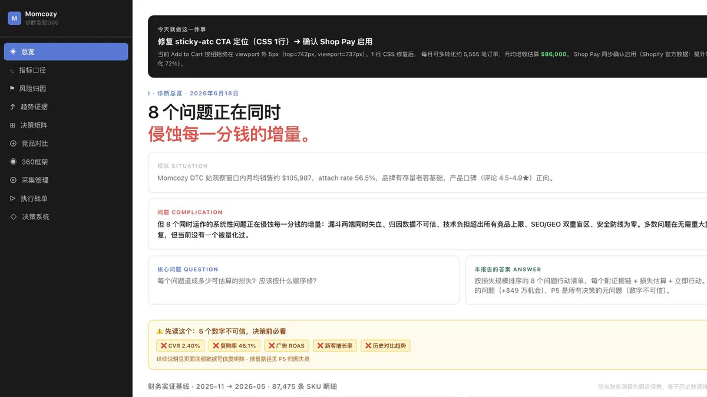
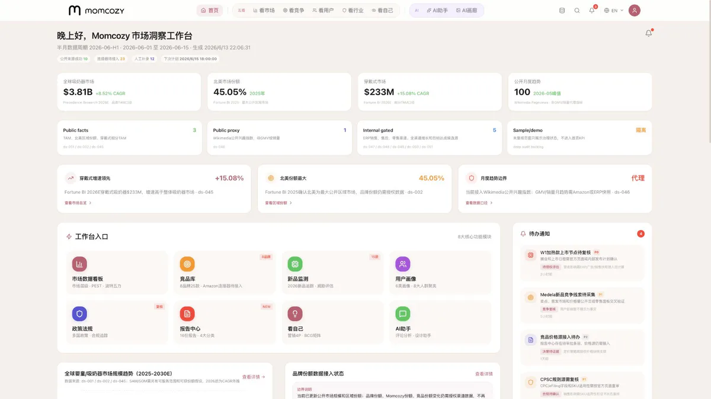
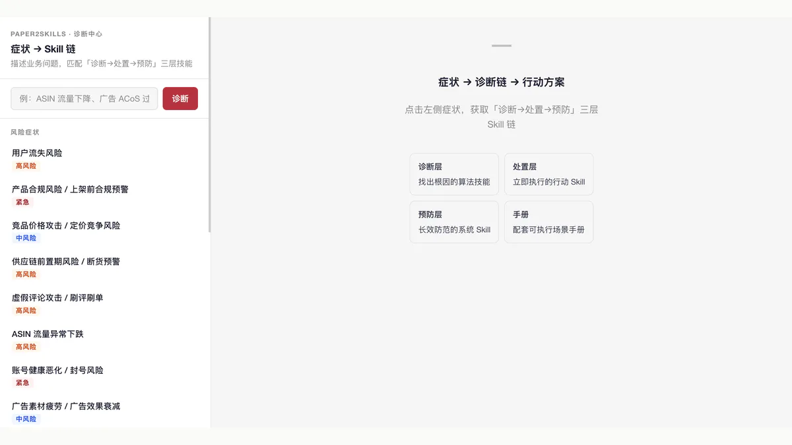

  

  <strong>Pray Chow｜路特 AI｜11 年数据科学与算法经验</strong> 
  用数据取证、市场洞察与多智能体协作，把复杂问题转化为可执行的业务系统。

## 我构建什么

我关注中国跨境品牌如何把分散的市场信号、消费者反馈和经营证据，转化为可执行、可验证、可持续运营的 AI 系统。

  

| 能力 | 解决的问题 | 代表项目 |
|---|---|---|
| 市场与消费者洞察 | 看清全球市场、消费者需求和竞品变化 | [mkt53](https://github.com/zjgulai/mkt53) · [VOC](https://github.com/zjgulai/VOC) |
| 品牌经营诊断 | 用公开证据识别独立站、性能和经营链路问题 | [Momcozy Audit 公开报告](https://shopify.lute-tlz-dddd.top/) |
| AI 内容生产 | 把策略、脚本、合规、生成、审核和分发连接成多 Agent 流程 | [Lute_AI_Video](https://github.com/zjgulai/Lute_AI_Video) |
| Agent 与知识基础设施 | 管理 Skills、MCP、研究知识和可视化知识图谱 | [Agent_skills](https://github.com/zjgulai/Agent_skills) · [Agent_mcp](https://github.com/zjgulai/Agent_mcp) · [paper_to_skills](https://github.com/zjgulai/paper_to_skills) · [kgraph](https://github.com/zjgulai/kgraph) |

## 公开、可核验的系统证据

> 截至 2026.07。数字来自对应公开仓库或公开报告，发布前会再次核验。

- **16 个 pipeline nodes、380+ tests** — [Lute_AI_Video](https://github.com/zjgulai/Lute_AI_Video)，面向跨境电商的多 Agent 短视频生产系统。
- **164 个 managed skills** — [Agent_skills](https://github.com/zjgulai/Agent_skills)，覆盖安装、分类、图谱、诊断与推荐。
- **30 个 MCP registry entries** — [Agent_mcp](https://github.com/zjgulai/Agent_mcp)，支持 opencode、codex、cursor 与 kimi。
- **从论文到业务 Skill** — [paper_to_skills](https://github.com/zjgulai/paper_to_skills)，把研究成果转化为决策卡片与可运行代码模板。

## 代表系统

### Lute AI Video · 多 Agent 内容生产

从策略、脚本、合规和分镜，到素材、生成、审核、分发与分析，形成跨境电商短视频生产闭环。

[查看代码与架构](https://github.com/zjgulai/Lute_AI_Video) · [打开线上系统](https://video.lute-tlz-dddd.top/)

### Momcozy Audit · 品牌经营诊断

把技术性能、KPI、竞品证据和行动优先级放进一套可持续更新的审计与监控系统。

[查看公开报告](https://shopify.lute-tlz-dddd.top/)

### Market Insight · 全球市场与消费者洞察

面向跨境品牌管理层，连接全球市场、消费者、竞品和数据来源复核。

[查看公开仓库](https://github.com/zjgulai/mkt53)

### Paper2Skills · 从研究到决策能力

把前沿论文转化为跨境电商可以复核、组合和执行的业务决策 Skill 与代码模板。

[查看项目](https://github.com/zjgulai/paper_to_skills)

## 当前方向

- 跨境品牌市场、消费者与 VOC 洞察
- 多 Agent 内容生产与知识系统
- 可验证、可部署、可持续运营的 AI 决策产品

---

### 让 AI 能力进入真实业务系统

[了解路特 AI](https://lute-tlz-dddd.top/) · [查看全部 GitHub 项目](https://github.com/zjgulai?tab=repositories)
