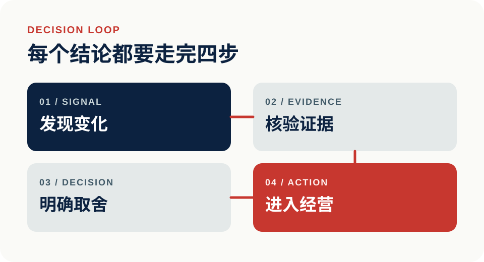

  

  <strong>11 年数据科学与算法｜164 项可治理 Skills｜81 项 Hook 自动化测试</strong> 
  为中国跨境品牌构建可核验的决策系统：把消费者信号、研究证据和供应链口径，转化为有负责人、有边界、可持续运营的经营动作。

  <a href="https://github.com/zjgulai?tab=repositories"><strong>查看代表项目</strong></a>
  ·
  <a href="#公开可核验的能力证据"><strong>查看能力证据</strong></a>

## 管理层真正需要的，不是更多信息

而是知道什么发生了、证据是否可信、应该做什么，以及谁来负责。

  

| 管理场景 | 从哪里出发 | 最终交付 |
|---|---|---|
| 消费者与市场信号 | 分散的评论、趋势、竞品与渠道数据 | 可复核的机会判断、风险排序与行动建议 |
| 供应链与经营治理 | 指标口径不一、负责人不清、写入边界模糊 | 有 owner、有定义、有审批门槛的上线清单 |
| AI 能力治理 | 零散 prompt、工具配置和个人经验 | 可安装、可诊断、可验证、可复用的能力资产 |

## 公开、可核验的能力证据

> 以下数字来自对应公开仓库。截至 2026.07，它们证明系统规模与治理方式，不等同于第三方业务收益审计。

- **164 个 managed skills** — [公开 registry](https://github.com/zjgulai/Agent_skills/blob/main/docs/data/skills.json)，覆盖安装、分类、图谱、诊断与推荐。
- **9 个 hook manifests、81 项 tests** — [Agent_hook](https://github.com/zjgulai/Agent_hook)，把安全检查、交付验证和上下文保存制度化。
- **30 项 P0 owner sign-off、18 项 P0 字段映射** — [scm](https://github.com/zjgulai/scm)，把供应链指标口径、负责人和生产写入边界前置；当前为只读原型。
- **4 步研究转化流程、审核阈值 ≥7/10** — [paper_to_skills](https://github.com/zjgulai/paper_to_skills)，把前沿研究转化为可复核的业务决策 Skill 与代码模板。

## 从证据到系统

### 01｜连接数据、证据、报告与告警

[data_achieve](https://github.com/zjgulai/data_achieve) 展示从原始记录到实体快照、信号、情报、证据、报告与告警的数据链路。

**管理层价值：** 让结论能回到数据来源，让重要变化能进入持续监控。

### 02｜让经营指标拥有 owner 和边界

[scm](https://github.com/zjgulai/scm) 将供应链指标、字段映射、审批要求和写入边界放进同一套只读工作台原型。

**管理层价值：** 在接入生产系统前，先解决“口径是什么、谁负责、什么条件下可以上线”。

### 03｜把研究与经验变成可复用能力

[paper_to_skills](https://github.com/zjgulai/paper_to_skills)、[Agent_skills](https://github.com/zjgulai/Agent_skills)、[Agent_hook](https://github.com/zjgulai/Agent_hook) 与 [kgraph](https://github.com/zjgulai/kgraph) 共同覆盖研究转化、能力注册、执行护栏和知识沉淀。

**管理层价值：** 让 AI 能力不依赖单次 Demo 或个人记忆，而是可以安装、审计、更新和复用。

## 工作原则

1. **证据先于结论**：关键判断必须能回到数据、来源或验收记录。
2. **决策必须可执行**：每项建议都要明确 owner、边界、优先级和验收方式。
3. **AI 必须可治理**：能力需要可安装、可诊断、可验证、可回退。

## 代表项目

| 经营链路 | 能力治理 | 知识沉淀 |
|---|---|---|
| [data_achieve](https://github.com/zjgulai/data_achieve) | [Agent_skills](https://github.com/zjgulai/Agent_skills) | [paper_to_skills](https://github.com/zjgulai/paper_to_skills) |
| [scm](https://github.com/zjgulai/scm) | [Agent_hook](https://github.com/zjgulai/Agent_hook) | [kgraph](https://github.com/zjgulai/kgraph) |

---

### 把复杂信息变成可执行的经营系统

[查看全部 GitHub 项目](https://github.com/zjgulai?tab=repositories)
